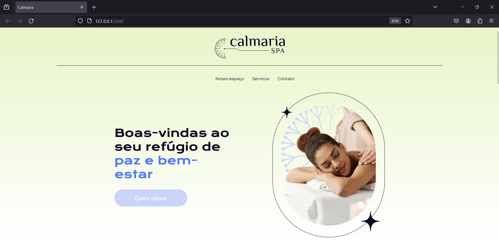
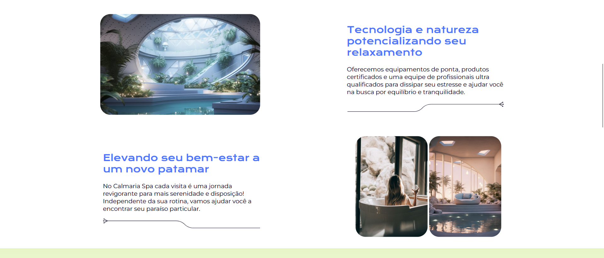
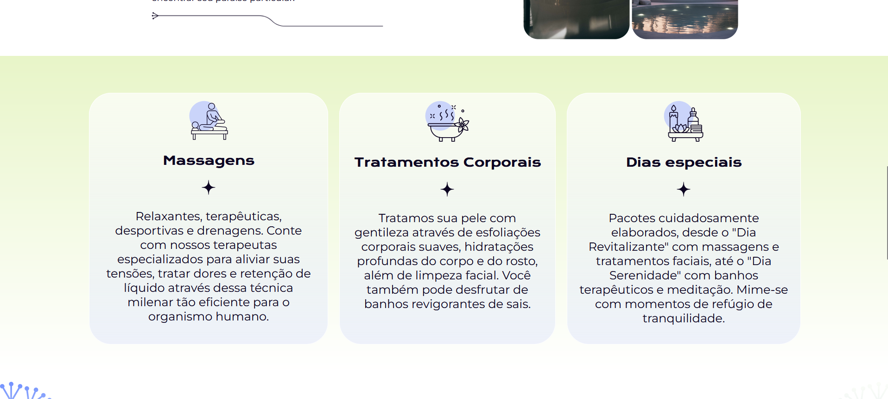
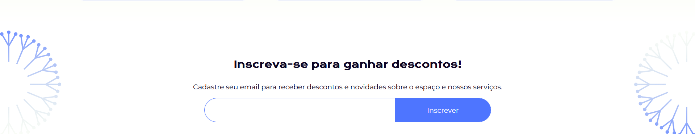
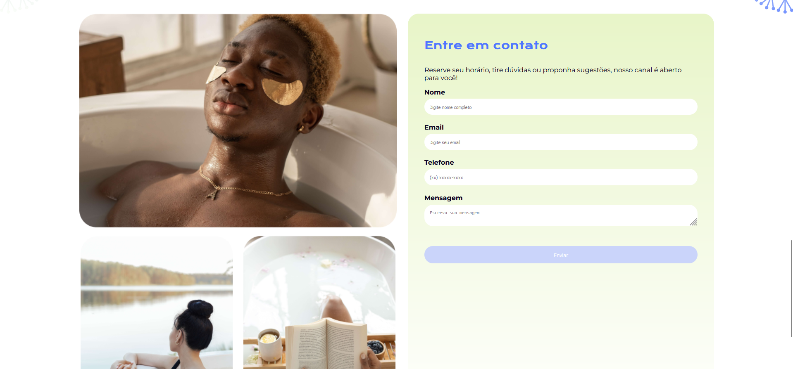

<h1>Cultura Spa</h1>

Seja bem vindo(a) ao repositório do Culturama Spa. Desenvolvido junto as instruções do professor <a target="_blank" href="https://github.com/diegocgayoso">Diego Carlos Martins</a></a>.

<h2>Aprendizados</h2>
<ul>
  <li>Conhece o SCSS;</li>
  <li>Criamos variáveis nos arquivos SCSS;</li>
  <li>Modularizamos o projeto;</li>
  <li>Criamos mixins;</li>
  <li>Utilizei o atalho SHIT + ALT + "seta para baixo" pela primeira vez.</li>
  <li>Revisamos práticas de flexbox.</li>
</ul>
<h2>Screen shots do projeto</h2>

<h2>Implementações necessárias</h2>

Tin
