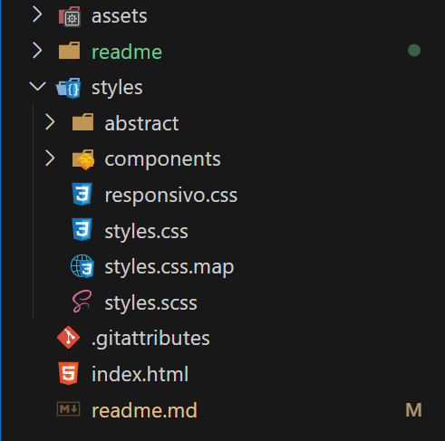
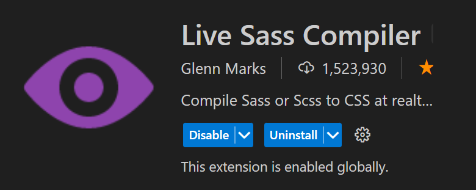
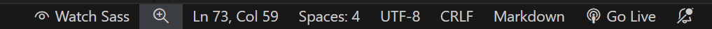
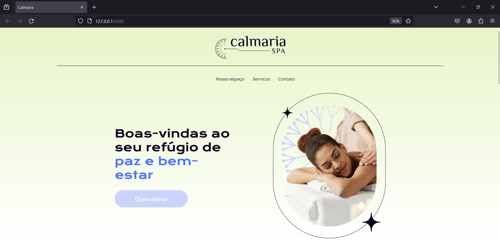
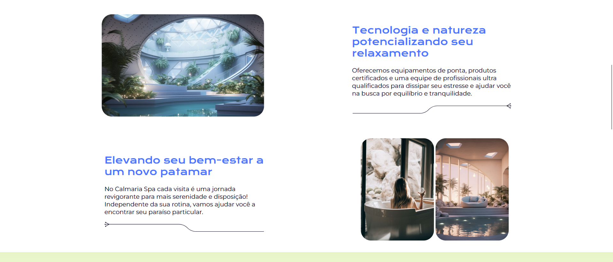
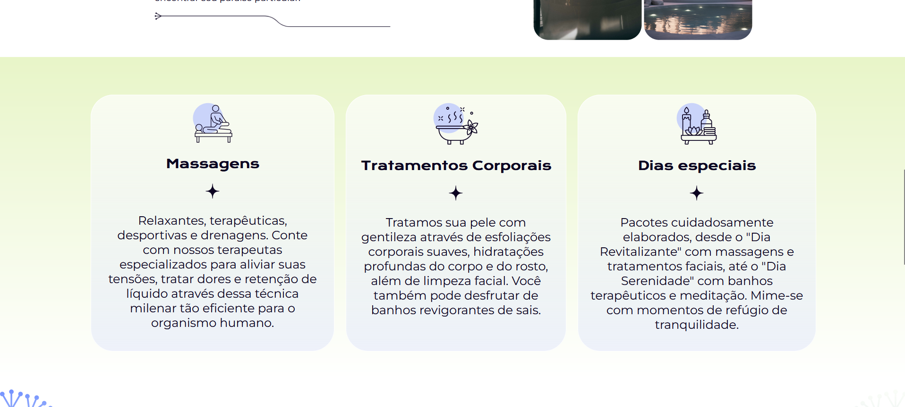
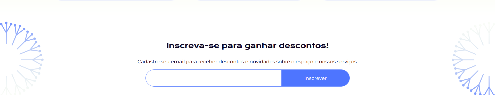
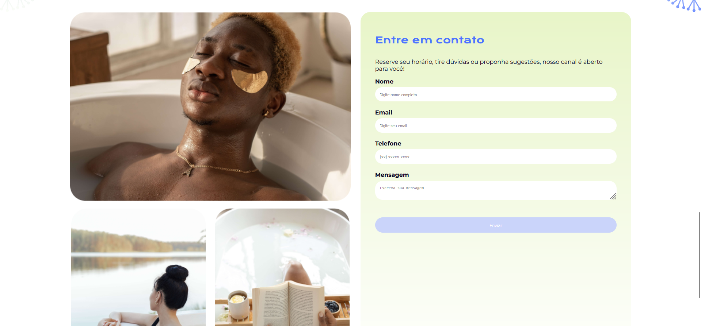

<h1>Estudo do projeto</h1>

Seja bem-vindo(a) à apresentação do projeto Cultura Spa, feito pelo time da Alura, a qual, através do instrutor Diego Carlos Martins, eu, Maciel, tive a oportunidade de assistir, codar, resumir e estar disponibilizando esse "Estudo de projeto" para você seguidor.

<h2>Ferramentas utilizadas</h2>
    
Sei que está curioso(a) para descobrir quais ferramentas e formatos de arquivos utilizamos. Abaixo estão as ferramentas do Desenvolvedor Front-end:

<ul>
    <li><strong>Microsoft Visual Studio Code:</strong> esta foi a IDE que usamos para codificar.</li>
    <li><strong>Firefox:</strong> o navegador é de sua preferência, mas sugerimos Google Chrome, Firefox ou Edge. É útil para inspecionar elementos "ao vivo".</li>
    <li><strong>Figma:</strong> recebemos o design do projeto através dessa ferramenta, onde podemos baixar arquivos, copiar medidas e propriedades, e entender a lógica do projeto.</li>
    <li><strong>Github:</strong> a ferramenta de versionamento de código foi o Github. Super rápido e fácil de entender.</li>
    </ul>

<h2>Organização de pastas no Microsoft Visual Studio Code</h2>
    <h3>Calmaria Spa</h3>

<ul>
    <li><strong>pasta-assets:</strong> a versão da pasta do projeto é diferente desta abaixo.
        <ol>
            <li>pasta-assets-figma
                <ol>
                    <li>pasta-icones-e-favicon
                        <ol>
                            <li>PNG: ícones e favicon em formato png</li>
                            <li>SVG: ícones e favicon em formato svg
                                <ol>
                                    <li>icone.svg</li>
                                </ol>
                            </li>
                        </ol>
                    </li>
                    <li>pasta-imagens
                        <ol>
                            <li>pasta-PNG: contém imagens isoladas e screenshots da tela do projeto, exceto ícones.</li>
                            <li>pasta-SVG: contém imagens em formato svg, exceto ícones.</li>
                        </ol>
                    </li>
                    <li>assets-figma-zip: arquivo em formato zip que contém todas essas pastas de assets e demais "arquivos".</li>
                </ol>
            </li>
        </ol>
    </li>
    <li><strong>style</strong>
        <ol>
            <li>abstract: contém arquivos que ajudam a aumentar a produtividade e economia de linhas de código.
                <ol>
                    <li>_mixins.scss: Este arquivo geralmente contém mixins, que são blocos de código CSS reutilizáveis.</li>
                    <li>_root.scss: Este arquivo é onde você pode definir variáveis CSS personalizadas no nível raiz.</li>
                    <li>_variaveis.scss: Este arquivo é onde você pode definir variáveis Sass.</li>
                </ol>
            </li>
            <li>pasta-components: contém os componentes, ou seja, as principais seções do projeto divididas em arquivos para uma melhor manutenção.</li>
            <li>responviso.css: arquivo com códigos que permitem que o layout do site se adapte ao tamanho da tela do usuário</li>
            <li>style.css: arquivo que receberá todos os códigos e modificações que forem realizadas no styles.scss.</li>
            <li>style.css.map: Este é um arquivo de mapa de origem. Os arquivos de mapa de origem são usados para mapear o código processado de volta ao seu código original.</li>
            <li>styles.scss: Este é um arquivo Sass (Syntactically Awesome Stylesheets).</li>
        </ol>
    </li>
    <li>.gitattributes: arquivo do github;</li>
    <li>index.html: arquivo html</li>
    <li>readme.md: readme do projeto com este texto.</li>
</ol>

<h2>Passos para entregar esse projeto</h2>
<!-- Inserir os passos aqui -->
<ol>
    <li style="list-style-type: decimal-leading-zero;">Entender o design do projeto no Figma;</li>
    <li style="list-style-type: decimal-leading-zero;">Criar a estrutura de pastas no VS Code e faça download das imagens em formatos svg preferencialmente;</li>
    
    <li style="list-style-type: decimal-leading-zero;">Instale "Live Sass Compiler" fornecido por Glenn Marks;</li>
    
    <li style="list-style-type: decimal-leading-zero;">Crie toda a estrutura do arquivo HTML, suas classes, conteúdo e chame as imagens.</li>
    <li style="list-style-type: decimal-leading-zero;">Crie o arquivo styles.scss</li>
    <li style="list-style-type: decimal-leading-zero;">Clique em "Watch Sass". Em casos</li>
    <li style="list-style-type: decimal-leading-zero;">Acesse a <a href="https://sass-lang.com/documentation/">documentação oficial do Sass</a> para tirar suas dúvidas.
    <li style="list-style-type: decimal-leading-zero;">Comece a estilizar o projeto de acordo com o Figma;</li>
    <li style="list-style-type: decimal-leading-zero;">Torne a página responsiva.</li>
</li>
    </ul>
</ol>

<h2>Screen shots do projeto</h2>
<figure>
    
    <figcaption>Home da página;</figcaption>
</figure>
<figure>
    
    <figcaption>Seção de <q>nosso serviço</q>;</figcaption>
</figure>
<figure>
    
    <figcaption>Seção de <q>serviços</q>;</figcaption>
</figure>
<figure>
    
    <figcaption>Seção de <q>inscreva-se</q>;</figcaption>
</figure>
<figure>
    
    <figcaption>Seção de <q>contato</q>;</figcaption>
</figure>

<h2>Desafios e agradecimentos</h2>

Meu maior desafio nesse projeto é/foi torna-lo responsivo, pois senti um pouco de dúvida se por ser em formato SCSS/SASS isso poderia implicar em algo mais desconhecido para mim até o momento.

Aqui, fica meu imenso agradecimento pela equipe da Alura e pelo instrutor em fornecer um curso de qualidade para nós <q>curiosos</q> profissionais/estudantes que buscamos nos desenvolver a cada dia. Abraço!!!

